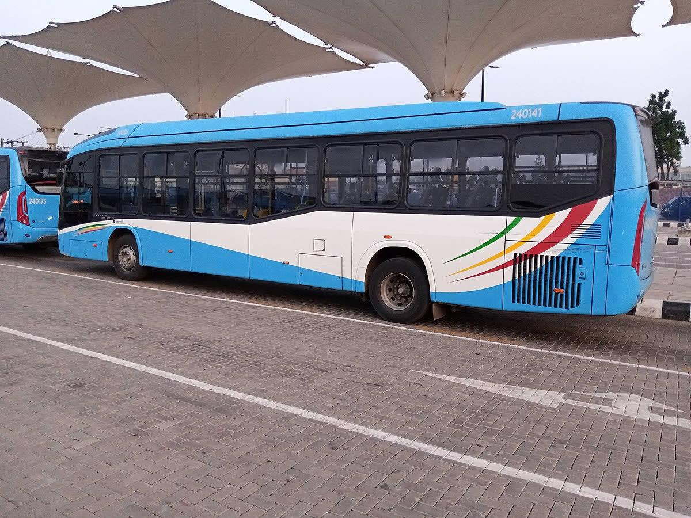
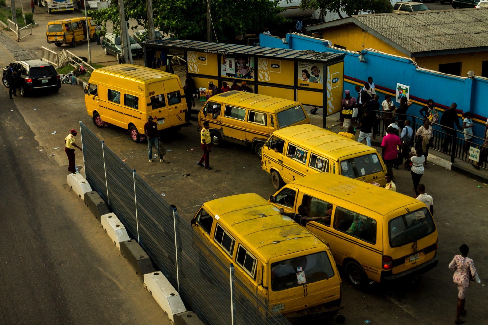
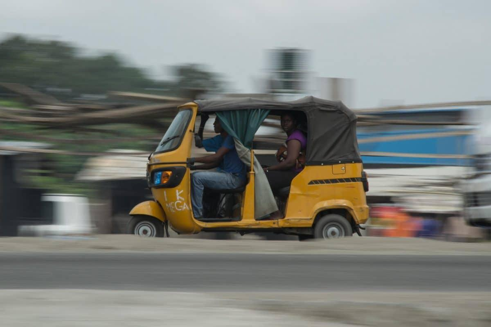
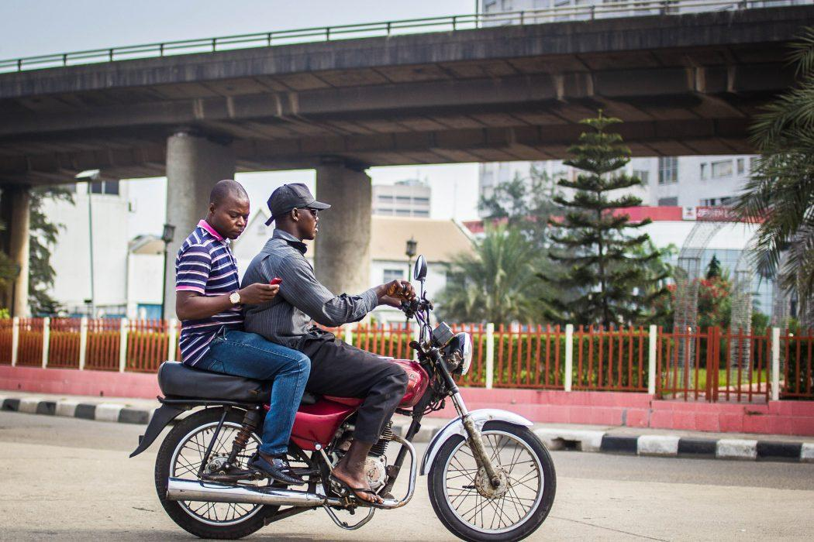
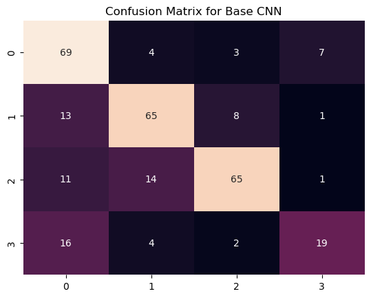
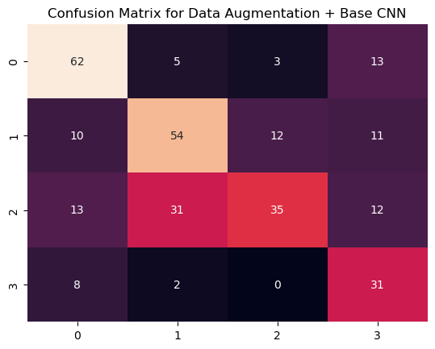
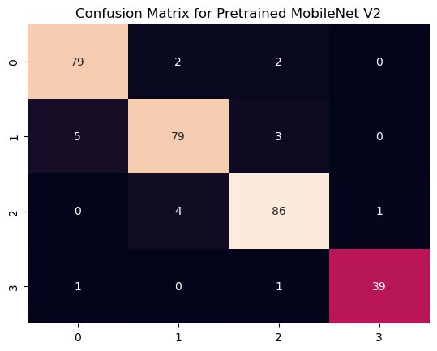
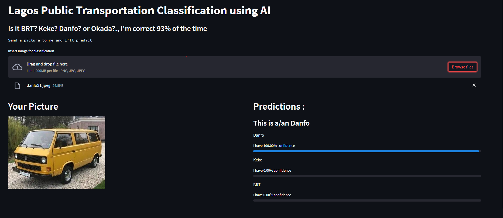

# Lagos Public Transportation Classification witth AI
___

The aim of this project is to build an application that can correctly classify four main types of public transportation in Lagos state, Nigeria. These vehicles include

* Bus Rapid Transit (BRT)

    *    

 

* Danfo / Bus

    *    

 

* Keke Napep / Keke Maruwa / Keke Tricycle

    *    

 

* Okada Bike / Motorcycle

    *    

___
The data was scraped using the [Google Image Scraper](https://github.com/ohyicong/Google-Image-Scraper) tool to extract all the images from Google
___

* Extracted the data 

* Arranged and label the data

* Performed various Data Preprocessing techniques such as converting images into tensors and feature normalization/scaling

* Used Convolutional Neural Networks (CNN), Data Augmentation and Transfer Learning / Pretrained Model to achieved best performance

* **Tuned MobileNet V2** achieved best performance with **97.9% traing accuracy** and **93.7% test accuracy**

<!-- * Model was deployed on a web application built using **Django** available at [Dementia Predictor](https://dementia-predictor.herokuapp.com/) -->
___
## Model Performamce
Accuracy with Confusion Matrix was used to evaluate performance. Data Augmentated CNN performed worse than Base CNN and Pre-trained Model

* Base CNN 
    * Training Accuracy : 97%
    * Testing Accuracy : 72.1%
    * Confusion Matrix
    

 

* Data Augmentation + Base CNN 
    * Training Accuracy : 57%
    * Testing Accuracy : 60.2%
    * Confusion Matrix
    

 

* **Tuned MobileNet V2**
    * Training Accuracy : 97%
    * Testing Accuracy : 72.1%
    * Confusion Matrix
    
___
<!--  -->
___
## Model Deployment
<!-- The final model with the best score was deployed on a web application built with **Django** with the frontend built with **HTML & CSS** with **Boostrap 4** as the CSS Framework.

 -->
___ 
